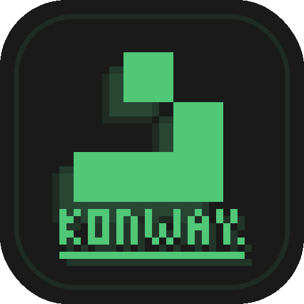
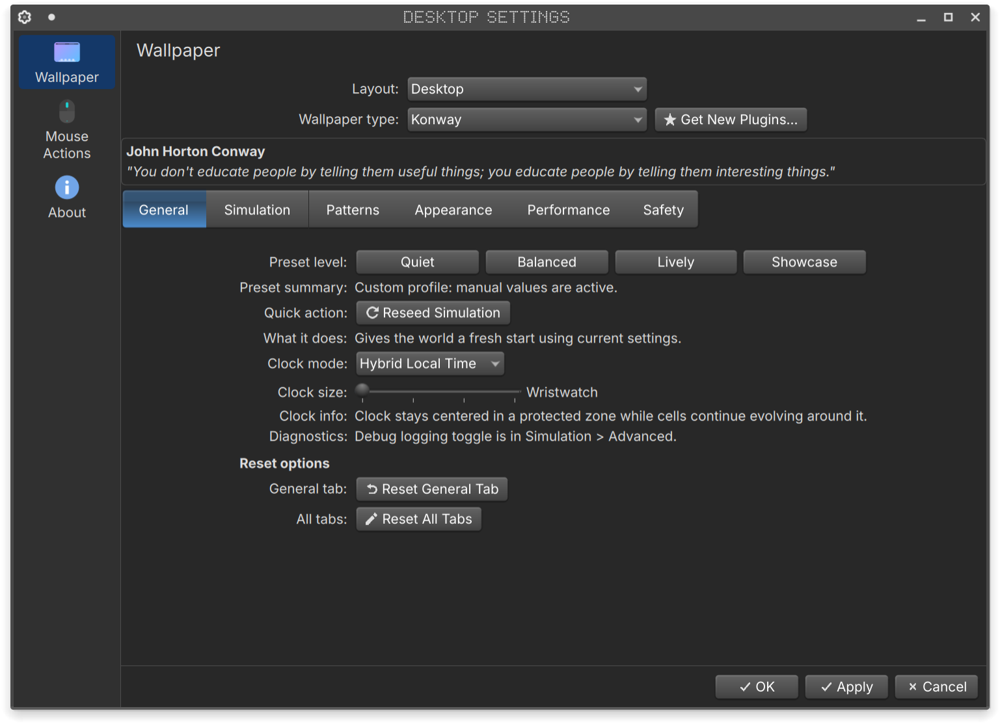
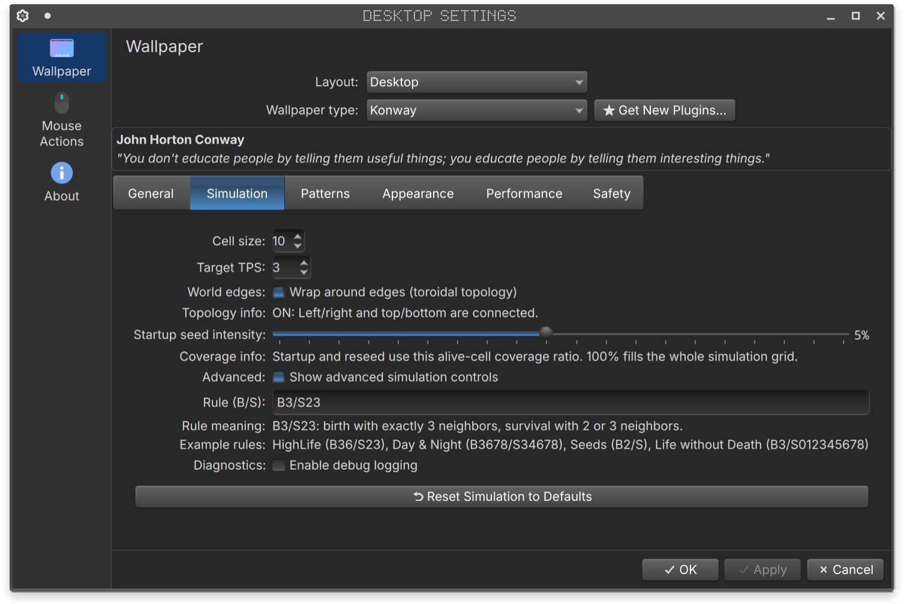
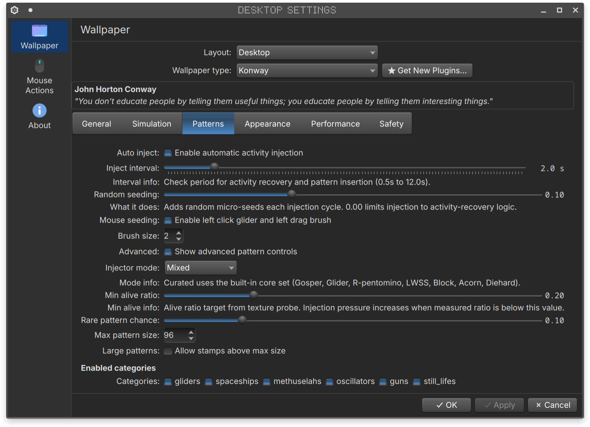
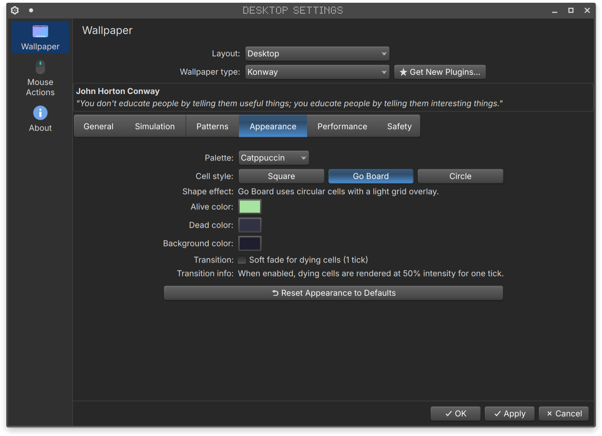
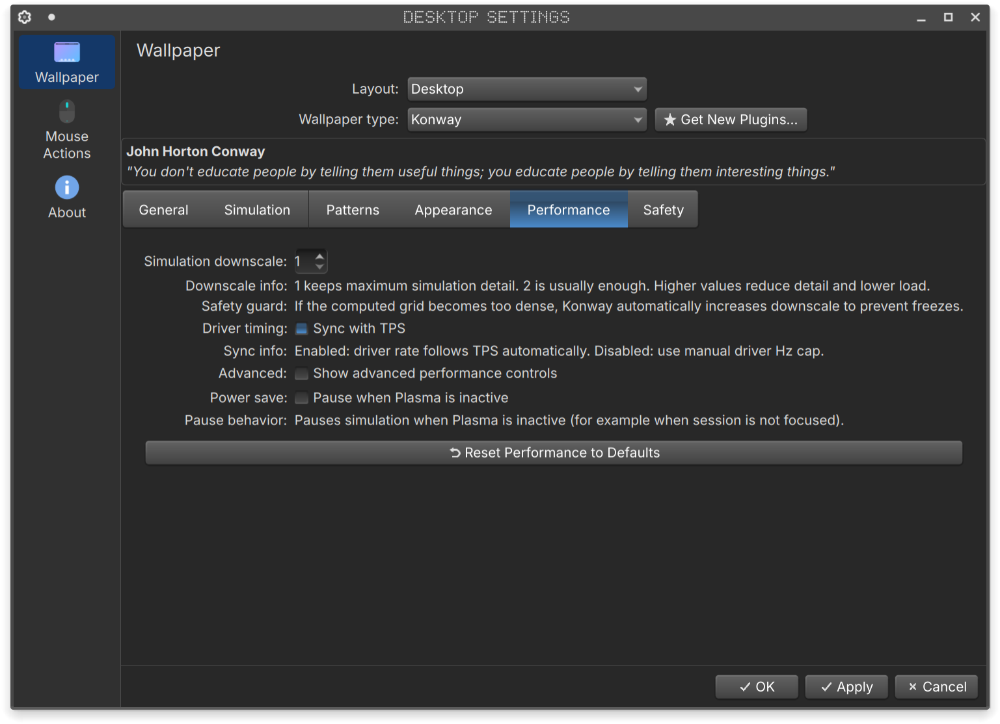
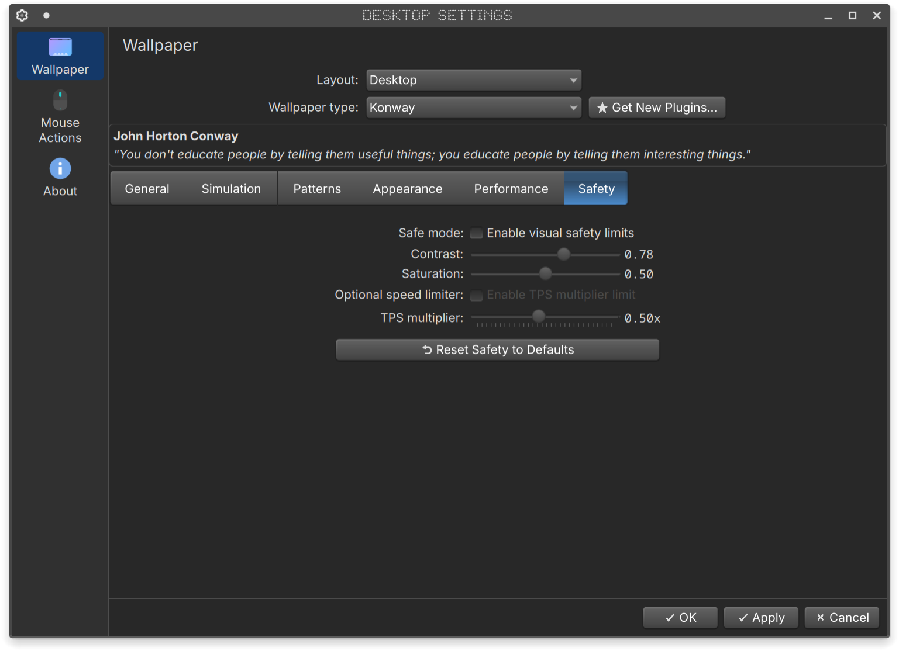

# Konway

<p align="center">
  
</p>

Konway is a lightweight, customizable cellular automaton engine integrated as a KDE Plasma 6 wallpaper plugin.

[demo.webm](https://github.com/user-attachments/assets/09198183-d5c2-430a-a4b2-1fdf05154a2e)


## <p align="center">[Settings GUI]</p>

<p align="center">
  
  
  
  <br>
  
  
  
</p>>


## // HIGHLIGHTS
- The simulation runs on the GPU, so even older PCs handle it well. There’s no per-cell CPU loop each frame, making Konway one of the most efficient live wallpaper plugins.
- Calm default look with built-in palette set:
  `Calm Dark, Paper Light, Emerald, Amber, Monochrome, Catppuccin, Dracula, Tokyo Night, Nord, Gruvbox, Everforest, Rose Pine`
- Optional resizable digital clock overlay mode (`Off` / `Hybrid Local Time`)
- Mouse seeding: left click places a glider, left drag uses brush
- Adjustable simulation rules. Supports arbitrary B/S (Birth/Survival) rule strings. Beyond standard Life (`B3/S23`), you can simulate other automata like HighLife (`B36/S23`) or Day & Night (`B3678/S34678`).
- Full settings UI tabs:
  `General, Simulation, Patterns, Appearance, Performance, Safety`
  
## // HOW IT WORKS

### 1. The GPU Pipeline
The simulation is stored in a texture (alive/dead cells).
Every tick, a shader reads the previous state and writes the next state (ping-pong / feedback).
No per-cell CPU loop each frame — the CPU mostly just schedules ticks. 

### 2. Entropy Management (Auto-Injection)
Classic automata tend to reach equilibrium (still life) over time in a closed environment. 
* **Dynamic Seeding:** When entropy drops below a threshold, it randomly injects curated patterns (Gliders, Methuselahs, R-Pentominoes etc.).
* **Purist Mode:** This behavior is fully configurable or can be disabled for a strictly deterministic run.

### 3. Visual Ergonomics
Raw cellular automata can produce harsh, rapid flickering (1-period oscillators) that can be distracting for a wallpaper.
* **Subtle trails:** Adjustable decay trails create a phosphor-persistence effect, smoothing out visual noise.
* **Safety Limits:** Integrated brightness clamping and contrast controls to prevent eye strain during long sessions.

## // INSTALL

### KDE Store

`Desktop and Wallpaper` -> `Get New Plugins...` -> search `Konway`

### Local Deploy

Run from `life.wallpaper/`:

```bash
./tools/deploy_local.sh
```

If Plasma still shows stale QML/settings:

```bash
plasmashell --replace & disown
```

## // Quick Settings Guide

- `Cell size`: visual size of cells
- `Target TPS`: simulation speed (ticks per second)
- `Sync with TPS`: keeps internal driver timing aligned with TPS
- `Pause when Plasma is inactive`: optional power save behavior

## // Build Shaders (`.qsb`)

From `life.wallpaper/`:

```bash
qsb --glsl "100 es,120,150" --hlsl 50 --msl 12 -o contents/shaders/life_step.frag.qsb contents/shaders/life_step.frag
qsb --glsl "100 es,120,150" --hlsl 50 --msl 12 -o contents/shaders/visualize.frag.qsb contents/shaders/visualize.frag
qsb --glsl "100 es,120,150" --hlsl 50 --msl 12 -o contents/shaders/population_probe.frag.qsb contents/shaders/population_probe.frag
```

or:

```bash
./tools/build_shaders.sh
```

## // Pattern Packs

Built-in pattern data:

- `contents/patterns/rle/<category>/*.rle`
- `contents/patterns/index.json`
- `contents/patterns/patternData.js`

Rebuild index/data after RLE edits:

```bash
./tools/build_patterns_index.py
```

Optional external pack helper:

```bash
./tools/download_external_pack.sh /path/to/manifest.txt
```

## // KPackage Build

Create install/upload archives:

```bash
./tools/build_kpackage.sh
```

Output:

- `dist/com.github.arcanorca.konway-<version>.kpackage.tar.gz`
- `dist/com.github.arcanorca.konway-<version>.kpackage.zip`

Local package install test:

```bash
kpackagetool6 --type Plasma/Wallpaper --install dist/com.github.arcanorca.konway-<version>.kpackage.tar.gz
```

## // License
GPL-3.0-or-later

## // Stack
KDE Plasma 6 • Qt 6 (QML/JS) • GLSL (.qsb via Qt RHI) • kpackagetool6

---

<p align="center">
  <i>Dedicated to the memory of John Horton Conway.</i>
</p>
